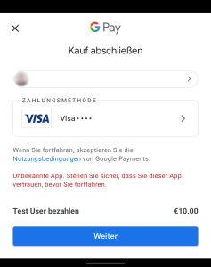

# Google Pay

Add Google Pay to your app:

## Events
* available
* success
* canceled
* error

## Methods
* setupPaymentGateway: name, apiKey
* createPaymentRequest: environment, price, countryCode, currencyCode, merchantName, supportedNetworks

## Constants
Gateways:
* PAYMENT_GATEWAY_STRIPE

Environment:
* ENVIRONMENT_PRODUCTION
* ENVIRONMENT_TEST

Networks:
* PAYMENT_GATEWAY_STRIPE
* PAYMENT_NETWORK_VISA
* PAYMENT_NETWORK_MASTERCARD
* PAYMENT_NETWORK_DISCOVER
* PAYMENT_NETWORK_AMEX
* PAYMENT_NETWORK_INTERAC
* PAYMENT_NETWORK_MIR
* PAYMENT_NETWORK_JCB

## Example

see <a href="./example/app.js">example/app.js</a>
